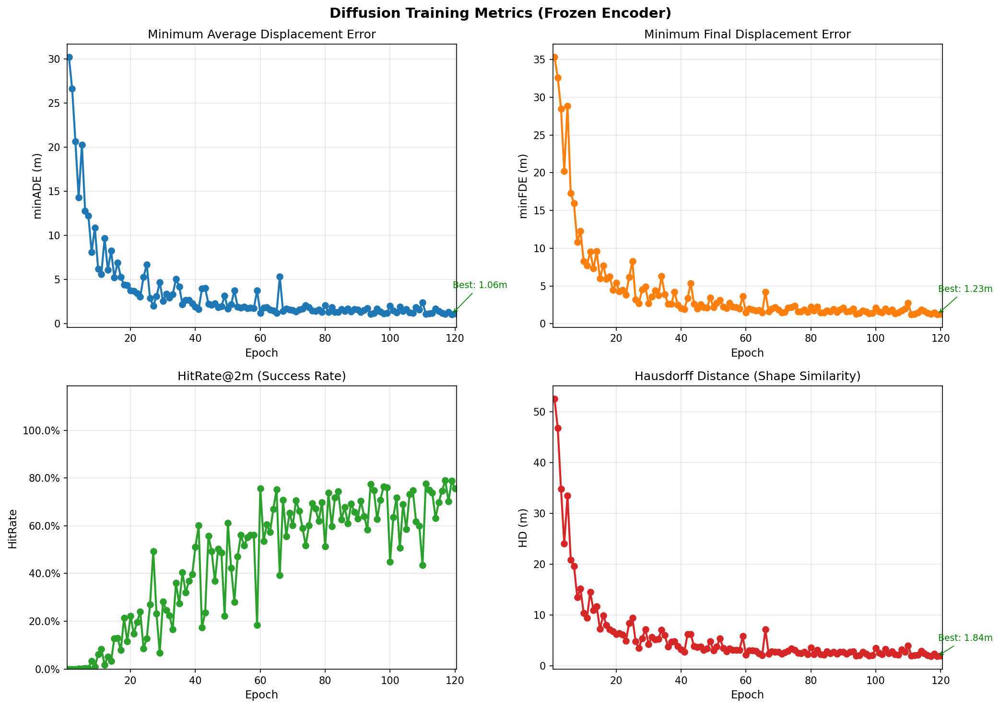


## Pre-trained Checkpoints

Download the LiDAR-only checkpoints from HuggingFace Hub:

```bash
# Create checkpoints directory
mkdir -p checkpoints

# Download encoder checkpoint (9.6 MB)
huggingface-cli download sangramrout/topodiffuser encoder_lidar_only_best.pth --local-dir checkpoints

# Download diffusion checkpoint (4.0 MB)
huggingface-cli download sangramrout/topodiffuser diffusion_lidar_only_best.pth --local-dir checkpoints
```

Or use Python:

```python
from huggingface_hub import hf_hub_download

encoder_path = hf_hub_download(
    repo_id="sangramrout/topodiffuser",
    filename="encoder_lidar_only_best.pth",
    local_dir="checkpoints"
)

diffusion_path = hf_hub_download(
    repo_id="sangramrout/topodiffuser",
    filename="diffusion_lidar_only_best.pth",
    local_dir="checkpoints"
)
```

**Model Details:**
- **Encoder:** LiDAR-only (3-channel: height, intensity, density) trained on sequences 00, 02, 05, 07
- **Diffusion:** Diffusion model with frozen encoder for trajectory prediction
- **Training Date:** February 17, 2026

## Diffusion Training

```
python -u train_diffusion_only.py \
    --encoder_ckpt checkpoints/encoder_lidar_only_best.pth \
    --resume checkpoints/diffusion_lidar_only_best.pth \
    --epochs 500 \
    --batch_size 64 \
    --lr 1e-4 \
    --noise_schedule cosine
```

## Encoder training

- Paper: out of 00-10 seq, only a handful was selected 
- Current implementation: Entire dataset of seq 00-10- randomly selected training and validation set from the dataset. 


## Training on paper vs implementation metrics

# all sequences

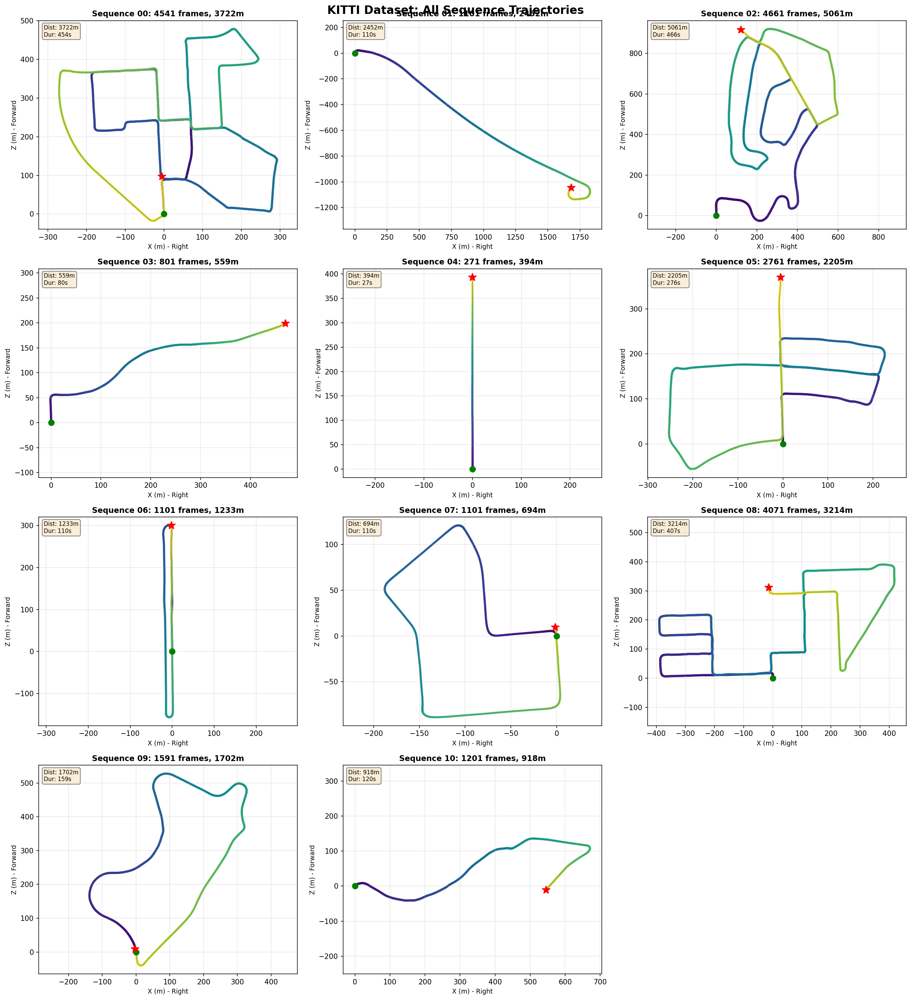

# training only on lidar data
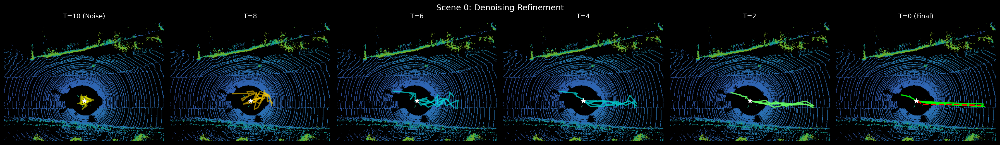

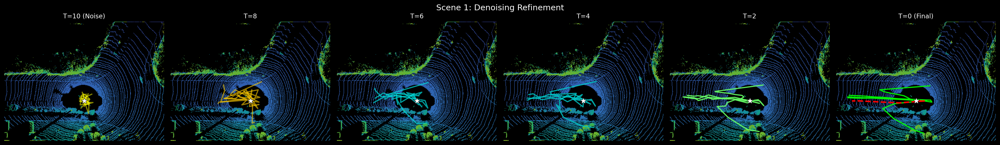

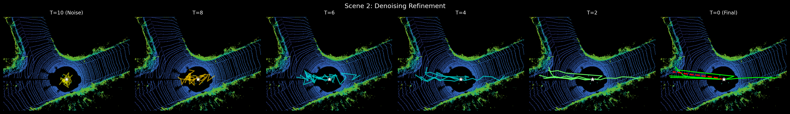

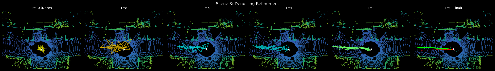

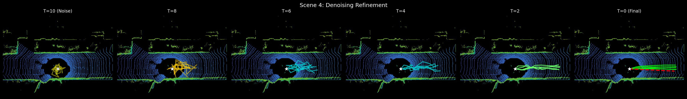

  From Table I in the paper:

| Metric | Paper Target | Your Best | Gap | Progress |
|--------|--------------|-----------|-----|----------|
| minADE ↓ | 0.26 m | 0.883 m | +0.62 m | 70% worse |
| minFDE ↓ | 0.56 m | - | - | - |
| HitRate ↑ | 93% | 82.5% | -10.5% | 89% there |
| HD ↓ | 1.33 m | 1.562 m | +0.23 m | 85% there |

**Notes:**
- minADE: Minimum Average Displacement Error
- minFDE: Minimum Final Displacement Error
- HitRate: Percentage of predictions within threshold
- HD: Hausdorff Distance

# All three modalities for each sequence side by side


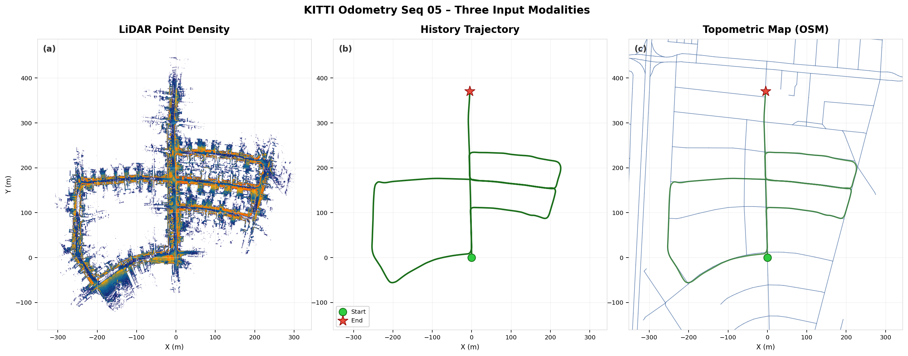
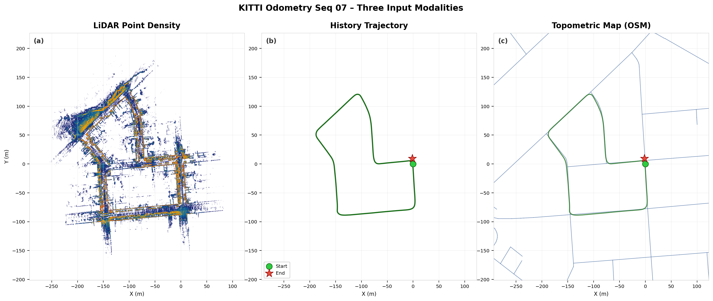
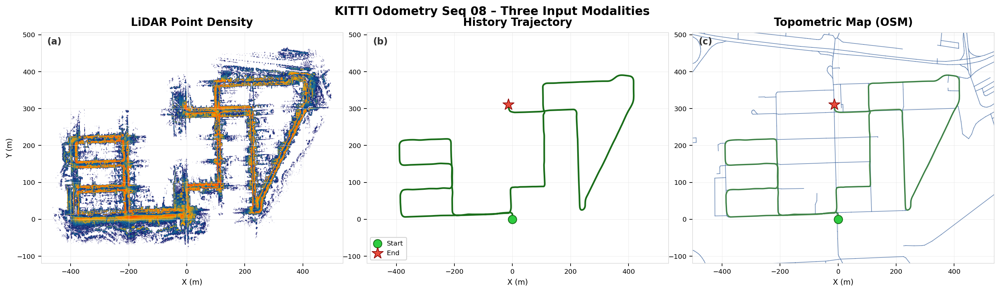

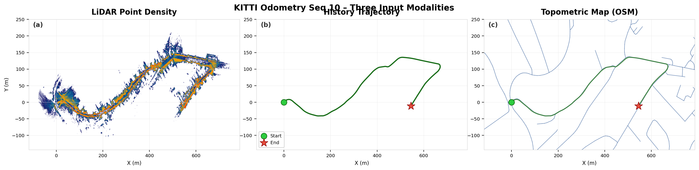

