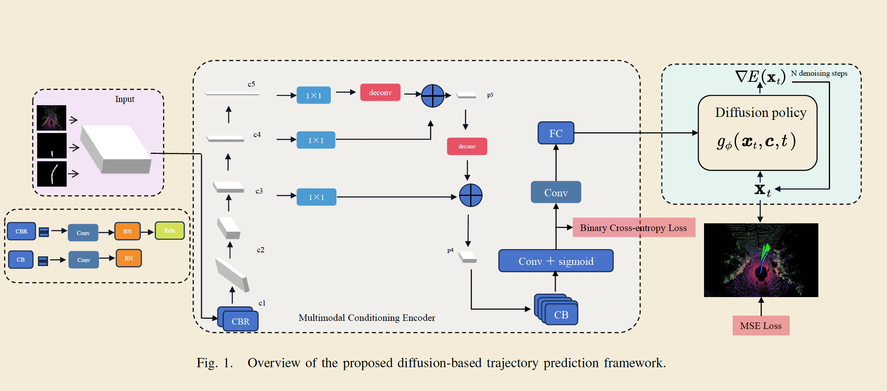

```
python -u train_diffusion_only.py \
    --encoder_ckpt checkpoints/encoder_expanded_best.pth \
    --resume checkpoints/diffusion_unet_latest.pth \
    --epochs 500 \
    --batch_size 64 \
    --lr 1e-4 \
    --noise_schedule cosine
```

## Encoder training

- Paper: out of 00-10 seq, only a handful was selected 
- Current implementation: Entire dataset of seq 00-10- randomly selected training and validation set from the dataset. 


## Training on paper vs implementation metrics

# training only on lidar data


  From Table I in the paper:

   Metric    Paper Target   Notes
  ━━━━━━━━━━━━━━━━━━━━━━━━━━━━━━━━━━━━━━━━━━━━━━━━━━━━━━━━━━━━━━
   minADE    0.26 m         Minimum Average Displacement Error
   minFDE    0.56 m         Minimum Final Displacement Error
   HitRate   0.93           93% of predictions within threshold
   HD        1.33 m         Hausdorff Distance


   Metric      Paper    Your Best   Gap       Progress
  ━━━━━━━━━━━━━━━━━━━━━━━━━━━━━━━━━━━━━━━━━━━━━━━━━━━━━━
   minADE ↓    0.26 m   0.883 m     +0.62 m   70% worse
   HitRate ↑   93%      82.5%       -10.5%    89% there
   HD ↓        1.33 m   1.562 m     +0.23 m   85% there